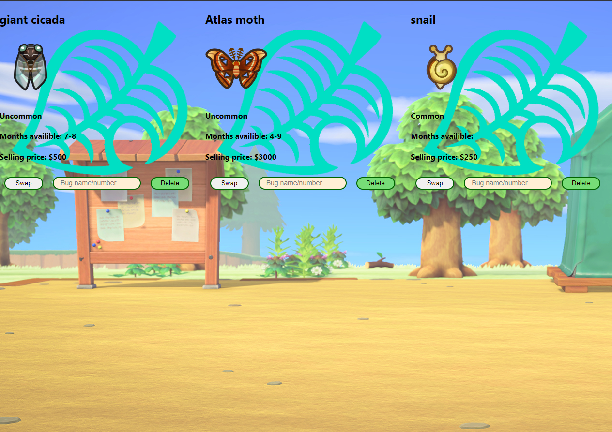

# Instructions
### An example CRUD app using React
* This app auto-fills all three slots.
* To swap, type in a valid name/number of a bug in the input box then click swap.
* To Delete, click delete.
* To add, type in a valid name/number of a bug in the input box, then click add.

